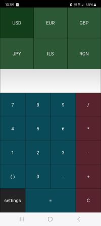

# Xchange
Simple multi-currency exchange rate app, 100% python

* Frontend using Kivy
* Backend using Flask

Built on top a plain calculator, this simple app adds multi-currency converting, based on daily-updated currency rates.
It was really handy for me when I was traveling and passing between multiple countries in short periods of time :)

Server side deploied as AWS lambda function, currency rates are sampled once a day from a web service, so it's all free 🌈

The app was on the Google Play Store but was recently removed due to lack of updates :-1:

